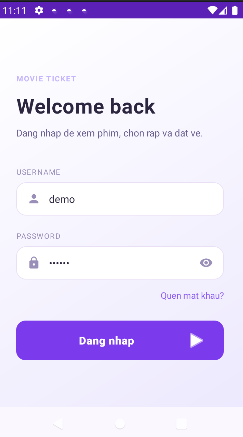

# 🎬 Movie Ticket App with Firebase

Ứng dụng đặt vé xem phim sử dụng Firebase cho Authentication và Database.

---

## 🚀 Tính năng chính

- 🔐 Đăng nhập / đăng ký (Email + Google)
- 🎥 Xem danh sách phim
- 🏢 Xem danh sách rạp
- ⏰ Chọn giờ chiếu
- 💺 Chọn ghế
- 📜 Xem lịch sử đặt vé
- 🔔 Nhận thông báo trước giờ chiếu

---

## 🖼️ Giao diện ứng dụng

### 🔐 Màn hình đăng nhập

  

---

### 🎥 Danh sách phim

  

---

### 🏢 Danh sách rạp

  

---

### 🎬 Thông tin phim

  

---

### ⏰ Chọn giờ chiếu

  

---

### 💺 Chọn ghế
chọn ghế

  

booking -> cập nhật trạng thái ghế

  

---

### 📜 Lịch sử chiếu

  

---

### 🔔 Thông báo trước giờ chiếu

  

